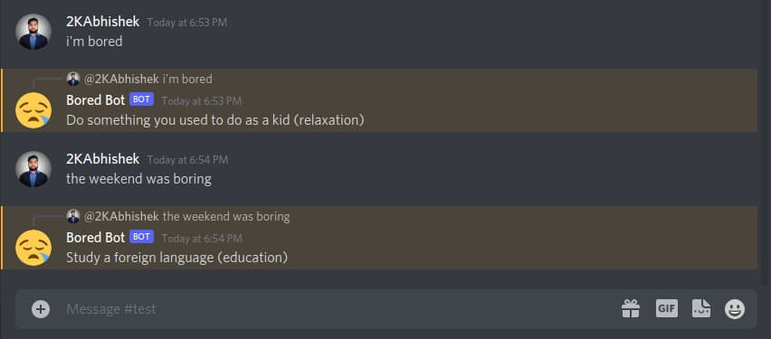

<div align = "center">

<h1><a href="https://2kabhishek.github.io/discord-bored-bot">discord-bored-bot</a></h1>

<a href="https://github.com/2KAbhishek/discord-bored-bot/blob/main/LICENSE">
 </a>

<a href="https://github.com/2KAbhishek/discord-bored-bot/graphs/contributors">
 </a>

<a href="https://github.com/2KAbhishek/discord-bored-bot/stargazers">
</a>

<a href="https://github.com/2KAbhishek/discord-bored-bot/network/members">
 </a>

<a href="https://github.com/2KAbhishek/discord-bored-bot/watchers">
 </a>

<a href="https://github.com/2KAbhishek/discord-bored-bot/pulse">
 </a>

<h3>Bored? ask this bot for fun activities! 🎇🎉</h3>

<figure>
  
  <br/>
  <figcaption>discord-bored-bot screenshot</figcaption>
</figure>

</div>

## What is this

discord-bored-bot is a bot that shows random activities one can do.

## Inspiration

Wanted to experiment with `discord.js` and bot development.

## Prerequisites

Before you begin, ensure you have met the following requirements:

- You have installed the latest version of `node`

## Getting discord-bored-bot

To install discord-bored-bot, follow these steps:

```bash
git clone https://github.com/2kabhishek/discord-bored-bot
cd discord-bored-bot
npm install
```

## Using discord-bored-bot

Visit [this link](https://discord.com/oauth2/authorize?client_id=904319736240803910&permissions=309237786624&scope=bot) to add Bored Bot to your Discord server.

## How it was built

discord-bored-bot was built using `discord.js, bored-api`

## Challenges faced

While building discord-bored-bot the main challenges were `<issue/difficulty>`

## What I learned

- Discord.js and it's API
- Basics of bot development

Hit the ⭐ button if you found this useful.

## More Info

<div align="center">

<a href="https://github.com/2KAbhishek/discord-bored-bot">Source</a> |
<a href="https://2kabhishek.github.io/discord-bored-bot">Website</a>

</div>
